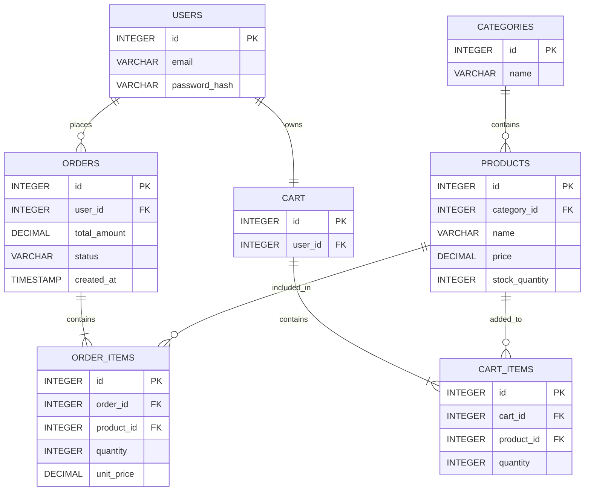

# ecommerce-2023# E-Commerce System

## Sprint 1: System Architecture & Scope

## 1. Target Audience & Market Focus

### Primary Persona

Our main users are customers who want to buy electronic products online. The system is mainly designed for students, working people, and general online shoppers.

### Core Pain Point

Customers may find it difficult to search for products, check prices and availability, and place orders easily. Our system provides a simple platform for browsing products and purchasing them online.

### Domain Scope

Our project focuses on **Consumer Electronics**, such as mobile phones, headphones, chargers, keyboards, and other computer accessories.

---

## 2. Minimum Viable Product (MVP) Feature Scope

The MVP includes the main features needed for our e-commerce system.

| Category       | Feature Name              | Description                                                  | Priority |
| -------------- | ------------------------- | ------------------------------------------------------------ | -------- |
| Authentication | User Registration & Login | Users can create an account and log in.                      | High     |
| Catalog        | Product List & Search     | Users can view, search, and filter products.                 | High     |
| Cart           | Cart Management           | Users can add, update, and remove products from the cart.    | High     |
| Checkout       | Order Processing          | Users can place an order from their cart.                    | High     |
| Admin          | Inventory Control         | Admin can add, update, and delete products and manage stock. | Medium   |

---

## 3. Tech Stack Selection & Justification

### Frontend Framework

**React.js**

React.js is selected because it is suitable for creating an interactive e-commerce interface. It also allows us to divide the website into reusable components.

### Backend Infrastructure

**Node.js with Express.js**

Node.js and Express.js are selected for developing the backend and APIs. They are simple to use and have good library support.

### Database Management System

**PostgreSQL**

PostgreSQL is selected because our system has related data such as users, products, orders, and carts. A relational database is suitable for managing these relationships.

### Caching & Asynchronous Processing

**Not included in the initial MVP.**

It can be added in the future if the system requires better performance.

---

## 4. Entity-Relationship Diagram (ERD)

The main entities of our system are Users, Products, Categories, Orders, Order_Items, Cart, and Cart_Items.

### Relationships

* One user can place many orders (**1:N**).
* One user has one cart (**1:1**).
* One category can have many products (**1:N**).
* One order can contain many order items (**1:N**).
* One product can appear in many order items (**1:N**).
* One cart can contain many cart items (**1:N**).
* One product can appear in many carts through Cart_Items (**1:N**).

### Primary and Foreign Keys

* `Users.id` → Primary Key
* `Categories.id` → Primary Key
* `Products.id` → Primary Key; `category_id` → Foreign Key
* `Orders.id` → Primary Key; `user_id` → Foreign Key
* `Order_Items.id` → Primary Key; `order_id` and `product_id` → Foreign Keys
* `Cart.id` → Primary Key; `user_id` → Foreign Key
* `Cart_Items.id` → Primary Key; `cart_id` and `product_id` → Foreign Keys

---

## Conclusion

Sprint 1 defines the basic scope and architecture of our e-commerce system. It covers the target users, main features, technology stack, and database structure. This design will be used as the foundation for the next development stages.
